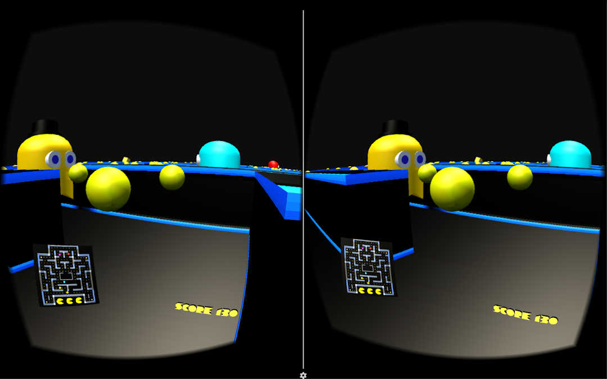

[![Made with Unity](https://img.shields.io/badge/Made%20with-Unity-57b9d3.svg?style=flat-square&logo=data%3Aimage%2Fpng%3Bbase64%2CiVBORw0KGgoAAAANSUhEUgAAAA4AAAAOCAMAAAAolt3jAAABklBMVEUIJCYRLjARLzEWICcbIyYcLDQdJS4dKjMdLTQeKTMeKTUeKjMeKzMeKzQeNDceNTkeNzkeODkfIy8fJi8fJjAfMDQgJzEgKDIgKTIgMTUgMjkhJjAhKDMhKTIhKTQhKzYhLDYhLDchLjUhLjYiKTAiLDciLTgjKjIjLTcjLjkkLTgnKDYnKTYnLjb%2F%2F%2F%2F%2F%2F%2F%2F%2F%2F%2F%2F%2F%2F%2F%2F%2F%2F%2F%2F%2F%2F%2F%2F%2F%2F%2F%2F%2F%2F%2F%2F%2F%2F%2F%2F%2F%2F%2F%2F%2F%2F%2F%2F%2F%2F%2F%2F%2F%2F%2F%2F%2F%2F%2F%2F%2F%2F%2F%2F%2F%2F%2F%2F%2F%2F%2F%2F%2F%2F%2F%2F%2F%2F%2F%2F%2F%2F%2F%2F%2F%2F%2F%2F%2F%2F%2F%2F%2F%2F%2F%2F%2F%2F%2F%2F%2F%2F%2F%2F%2F%2F%2F%2F%2F%2F%2F%2F%2F%2F%2F%2F%2F%2F%2F%2F%2F%2F%2F%2F%2F%2F%2F%2F%2F%2F%2F%2F%2F%2F%2F%2F%2F%2F%2F%2F%2F%2F%2F%2F%2F%2F%2F%2F%2F%2F%2F%2F%2F%2F%2F%2F%2F%2F%2F%2F%2F%2F%2F%2F%2F%2F%2F%2F%2F%2F%2F%2F%2F%2F%2F%2F%2F%2F%2F%2F%2F%2F%2F%2F%2F%2F%2F%2F%2F%2F%2F%2F%2F%2F%2F%2F%2F%2F%2F%2F%2F%2F%2F%2F%2F%2F%2F%2F%2F%2F%2F%2F%2F%2F%2F%2F%2F%2F%2F%2F%2F%2F%2F%2F%2F%2F%2F%2F%2F%2F%2F%2F%2F%2F%2F%2F%2F%2F%2F%2F%2F%2F%2F%2F%2F%2F%2F%2F%2F%2F%2F%2F%2F%2F%2F%2F%2F%2F%2F%2F%2F%2F%2F%2F%2F%2F%2F%2F%2F%2F%2F%2F%2F%2F%2F%2F%2F%2F%2F%2F%2F%2F%2F%2F%2F%2F%2F%2F%2F%2F%2F%2F%2F%2F%2F%2F%2F%2F%2F%2F%2F%2F%2F%2F%2F%2F%2F%2F%2F%2F%2F%2F%2F%2F%2F%2F%2F%2F%2F%2F%2F%2F%2F%2F%2F%2F%2F%2F%2F%2F%2F%2F%2F%2F%2F%2F%2F%2F%2F%2F%2F%2F%2F%2F%2F%2F%2F%2F%2F%2F%2F%2F%2F%2F%2F9oVHO%2FAAAAhXRSTlMAAAAAAAAAAAAAAAAAAAAAAAAAAAAAAAAAAAAAAAAAAAAAAAAAAAAAAAAAAAAAAQUGCAkMDhATFBcZGh0hIyYtNT1IS05RVFZXW1xeYWNnbG9wcXN2eHt9goaKkpWXo6usrbCztLW2ubq7vL2%2Bv8HDxsjKzNfY5OXn6%2Bzt8fP09vj5%2FP3%2BxDGH3QAAAMlJREFUeAFjUFTiZ5AWEFQ1dgwvDuIEc8WkHDJrW1tb07nBXHOb%2FPIYz7LWSgsgl8%2B9NclWjz24LrTVmUFR2b0110SE1aYhyqg%2BmkHRozXNkE2LI67KXDy7iMG7uTUnITU5s9WXhSfQi8GvtbUgMz%2BvsNVLSMbfjUHUpzVRX0VXPb7ClCujiEGSyac1xUhY1q4pwqAulkGSkdmnNd5KTiKsJqDVBcTVtLbPL410LW%2BptgRz5dUcixpbW1qzuMFcBW0dDTOnqJIQXgB6SzT11MCPiQAAAABJRU5ErkJggg%3D%3D)](https://unity3d.com)


[](https://github.com/iamtomhewitt/vr-pacman/issues )


# VR Pacman

<p align="center">
  
</p>

This project is my Unity3D game on Google Play. It is a virtual reality version of the arcade game Pacman, in first person, targeted for mobile devices using a Google Cardboard or similar.  

## Fixing Problems

Issues are currently tracked under the [Issues](https://github.com/iamtomhewitt/vr-pacman/issues) tab.  

Choose an issue, create a new branch for it and code it. Make sure to update the [Issue Management Project](https://github.com/iamtomhewitt/vr-pacman/projects/1) so the issues can be tracked effectively.  

When you are done create a pull request and I will review the code before it can be merged into the develop branch.
Once we are ready, the develop branch will be merged into the 'beta' branch, where a beta build will be created from it and uploaded to Google Play.
After the beta has ended, or another one comes along, then the beta branch will be merged into master. The beta in Google Play will then be promoted to production.
Add beta and production git tags to the branches so it can be easily identified.

# Code Style

## Files & Folders
Organise scripts and folders into the same category. They can either be grouped by a component, or types, such as: 

```c#
Assets
    Models
        Dragon
            Model.fbx
            Map.png
        Wizard
            Model.fbx
            Map.png
    Scripts
        Dragon
            Fly.cs
            Roar.cs
        Wizard
            Movement.cs
            Spells.cs

// Or the following way can be used

Assets
    Dragon
        Model.fbx
        Map.png
        Fly.cs
        Roar.cs
    Wizard
        Model.fbx
        Map.png
        Movement.cs
        Spells.cs
```
The first way is usually preferred, but it depends on the project.

## Namespaces

Don't use ```com.fpsgame.hud.healthbar```, instead use ```FpsGame.Hud.Healthbar```

## Braces

Braces should follow the One True Brace Style, and always start on a new line, for example: 

```c#
if (something)
{
    // Correct
}

if (something) {
    // Incorrect
}
```
Brace should be used even if there is one statement.

## Comments

Single line or multiline comment: 

```c# 
// Example
```

Documentation above a method or a class:

```c#
/// <summary>
/// Randomly selects a GhostPath to use as the waypoint path from the paths in the scene.
/// Selects a path that is currently not being used by another ghost.
/// </summary>
```

## Documentation

Documentation should only be used when necessary, for example the method ```GetName()``` does not need documenting, but a method like ```SelectNewPath()``` would perhaps need some documentation on where the request is going and what type of request it is.

Each class should also have a relevant documentation block before it:

```c#
/// <summary>
/// Checks if any of the Ghosts are running home. If at least one Ghost is running home this method returns true.
/// </summary>
public bool AllGhostsRunningHome()
```

# *Statements*

## Classes

Written in the ```UpperCamelCase``` form.
See the Camel Case Definition section for classes which have acronyms. 

## Methods

Written in the ```UpperCamelCase``` form. Methods should be self describing and only do one thing, for example ```MovePlayer()``` or ```GetHealth()```. If the method does more than one thing, it needs to be refactored.
Other examples:
    
```c#
GetScoresViaHttp(); // NOT: getScoresViaHTTP();
SaveAsJson();       // NOT: saveAsJSON();
```

Methods should have no more than four parameters. If it requires more, refactor your code (for example, use a Builder or an instance variable).
Parameters should remain on the same line unless its absolutely necessary to put them on a new line (e.g. readability):  

```c#
Debug.Log("Failed to process"
        + " request " + request.GetId()
        + " for user " + user.GetId()
        + " query: '" + query.GetText() + "'");
```

## Constants

Constants are written in ```CONSTANT_CASE```: 

```c# 
private int SOME_VARIABLE = 5;
```

## Variables

Written in the ```lowerCamelCase``` form. Variables should be self describing. They should be prefixed with ```public``` or ```private```, and ordered in the following way in a class: ``` public <Type>, public <primative>, private <Type>, private <primative>```. For example:

```c#
public GameObject readyText;
public int numberOfFood;
public bool canStartGame;

private Ghost[] ghosts;
private bool spawnedCherry;
```

Do not use public variables unless absolutely necessary. Variables should be private with a public ```Get()``` and ```Set()``` method.

If a GameObject is only present once in a scene, then the following instance method should be used

```c#
// GameManager.cs

public static GameManager instance;

void Awake()
{
    if (instance == null)
    {
        instance = this;
    }
    else
    {
        Destroy(this.gameObject);
        return;
    }
}
```
It would be then used in another script:
```c#
GameManager.instance.DoSomething();
```

Variables that need to be private but need to be shown in Inspector should use the ```[SerializeField]``` before a variable. For the other way around, use ```[HideInInspector]```

## Conditions

Where applicable, use a Ternary operator for simple statements:

```c#
int number = 10
bool isLessThanTen = (number < 10) ? true : false; 

// Instead of

int number = 10;
bool isLessThanTen;
if (number < 10)
{
    isLessThanTen = true;
}
else
{
    isLessThanTen = false;
}
```

Switch statements should always have a default statement:

```c#
switch (condition)
{
    case someCase:
        // do something
        break;
    
    case anotherCase:
        // do something else
        break;

    default:
        // do a default, perhaps logging or a default value
        break
}
```

## Camel Case Defined

Camel casing should follow this rule:

|           Form          |      Correct      |     Incorrect     |
|:-----------------------:|:-----------------:|:-----------------:|
| "XML HTTP request"      | XmlHttpRequest    | XMLHTTPRequest    |
| "new customer ID"       | newCustomerId     | newCustomerID     |
| "supports IPv6 on iOS?" | supportsIpv6OnIos | supportsIPv6OnIOS |
