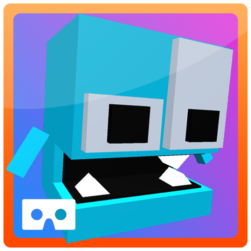

	
	
	

	
	

Built with ❤︎ by <a href="https://github.com/iamtomhewitt">Tom Hewitt</a>

Become a Beta Tester <a href="https://play.google.com/apps/testing/com.SwivelChairGames.VRPacman">here</a>!

------------

## Getting Started 🛠
- Install [Unity Hub](https://unity.com/) and open the project with latest version of Unity.
- If you want to test on an Android device you will need to install the Android module.

## Acknowledgements 🙌

- Carmine T. Guida for [Dreamlo](http://dreamlo.com/). It's a very easy to use online leaderboard and I've used it in many of my projects.